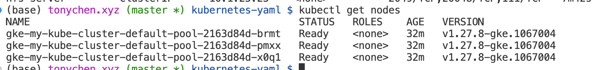
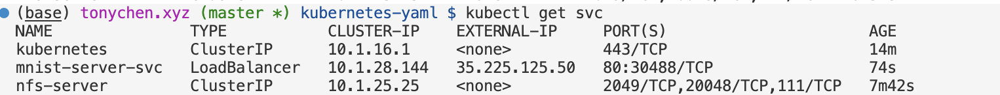

# Introduction
This project trains and predictions MNIST digit recognition with Kubernetes on GCS.

# How to run
## Create Kubernetes cluster
```
gcloud container clusters create my-kube-cluster \
--zone=us-central1-a \
--disk-size=20GB \
--disk-type=pd-standard \
--num-nodes=3
```
```
gcloud container clusters get-credentials my-kube-cluster --zone us-central1-a
```
Verify with `kubectl get nodes`


## Create disk
```
gcloud compute disks create --type=pd-standard --size=10GB --zone=us-central1-a ml-kube-disk
```

## Training

Create docker environment
```
cd ../trainer
docker build -t mnist-trainer .
```
Push docker environment to GCR
```
docker push gcr.io/summit2-414722/mnist-trainer
```
`summit2-414722` was my project name. 

Set hyperparams
```
export WORKER_NUMBER=3
export EPOCH=2
export BATCH=100
```
Enter yaml directory for Kubernetes
```
cd ../kubernetes-yaml
```
Create  NFS container to store datasets and models
```
kubectl apply -f 1-nfs-deployment.yaml
kubectl apply -f 2-nfs-service.yaml
```
Create PVC
```
export NFS_CLUSTER_IP=$(kubectl get svc/nfs-server -o jsonpath='{.spec.clusterIP}')
cat 3-nfs-pv-pvc.yaml | sed "s/{{NFS_CLUSTER_IP}}/$NFS_CLUSTER_IP/g" | kubectl apply -f -
```
Split dataset
```
cat 4-splitter.yaml | sed "s/{{WORKER_NUMBER}}/$WORKER_NUMBER/g" | kubectl apply -f -
```
Train each dataset
```
for (( c=0; c<=($WORKER_NUMBER)-1; c++ ))
do
  echo $(date) [INFO] "$c"th Creating th trainer in kubernetes..
  cat 5-trainer.yaml | sed "s/{{EPOCH}}/$EPOCH/g; s/{{BATCH}}/$BATCH/g; s/{{INCREMENTAL_NUMBER}}/$c/g;" | kubectl apply -f - &
done
```
Aggregate trained models
```
kubectl apply -f 6-aggregator.yaml
```
## Serve the model
Create and push docker environment for server
```
cd ../server
docker build -t mnist-server .
docker push gcr.io/summit2-414722/mnist-server
```
Apply yaml file
```
cd ../kubernetes-yaml
kubectl apply -f 7-server.yaml
```
Get IP address of server
```
kubectl get svc
```

Access the external address of external-ip of mnist-server-svc in browser `35.225.125.50:80` we can access the web app. The usage of webapp is documented in the video `screen_capture.mov`

[screen_capture.mov](screen_capture.mov)

# Conclusions

For training the MNIST digit recognition model, several Kubernetes controllers were employed:
- Deployment: Used to create and manage the NFS server pods for storing datasets and models. Deployments provide a declarative way to define the desired state of the pods.
- Service: An NFS service was created to expose the NFS server and allow other pods to access the shared storage. Services enable communication between pods and provide a stable network endpoint.
- PersistentVolume (PV) and PersistentVolumeClaim (PVC): PV and PVC were used to provision and claim the persistent storage for the NFS server. This ensures that the data is persisted even if the NFS server pods are restarted or rescheduled.
- Job: Used for the dataset splitter and model trainers. Jobs are suitable for running finite tasks that are expected to complete successfully. Each trainer job processes a portion of the split dataset.

For serving the trained model and enabling inference, a Deployment and a Service were utilized:
- Deployment: Used to create and manage the server pods that host the trained model and expose the prediction API. Deployments ensure the desired number of server replicas are running.
- Service: Exposes the server pods to the external network, allowing access to the web application for making predictions. The service provides load balancing and a stable IP address for accessing the server.


# Citations
```
[1] https://kubernetes.io/docs/tutorials/
[2] https://github.com/ml-kubernetes/MNIST
```
